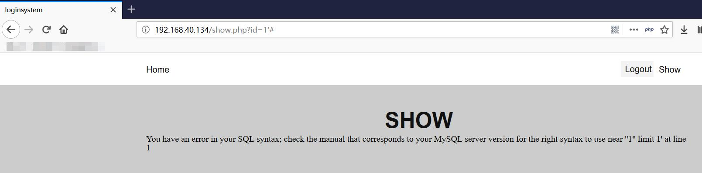
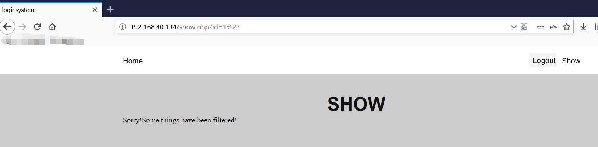
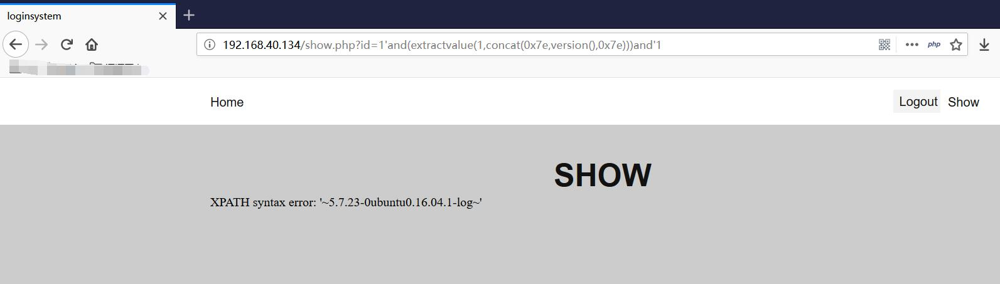
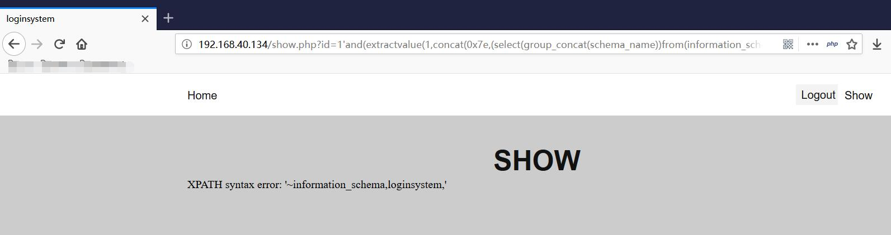
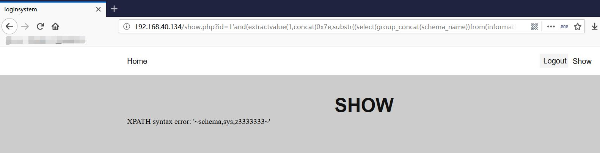
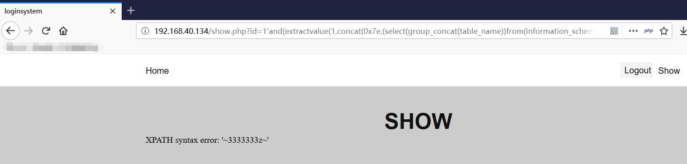
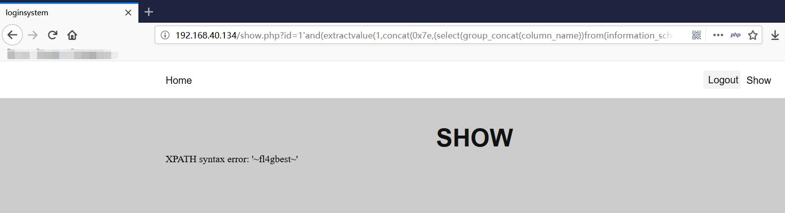
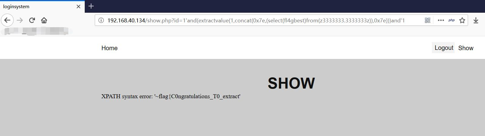
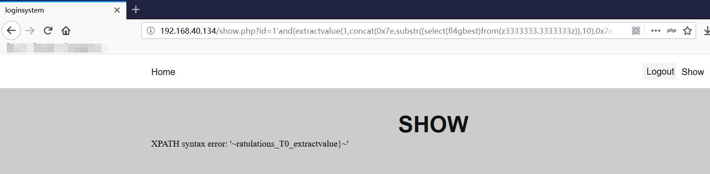

# WrongSQL

##### 1.描述

一个开源的关于报错注入的靶机，内置两个docker环境，源码相同，第一个dockerfile基于tutum/lamp环境，第二个dockerfile根据
[ciscn](http://www.ciscn.cn/upload/file/20190629/1561790069686905.zip "ciscn")
的模版改编，数据库密码设置为123456，目的为了练习docker环境的搭建

##### 2.writeup

1)  注册账号后在show.php发现注入点

2)  尝试使用’#等字符进行注入,发现被过滤的一些字符

3)  尝试extractvalue报错注入

4）获取数据库1

5）获取数据库2

6)   获取表

7）获取列

8）获取flag1

9）获取flag2

10）得到flag｛C0ngratulations_T0_extractvalue｝

11)分析与思考： 

报错注入不止extractvalue注入,学习更多的报错注入方式(此题过滤了updatexml)

<https://www.cnblogs.com/wocalieshenmegui/p/5917967.html>

报错注入的长度问题,最大长度为32位,利用substr进行输出

##### 3.如有问题请联系iloveflag@outlook.com
##### 2020-7-9 dockerfil2 正在下线修复
